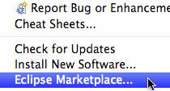
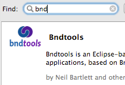
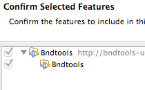
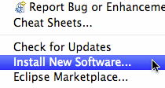
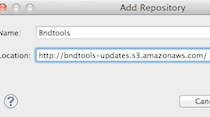
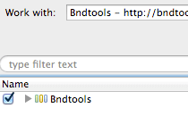
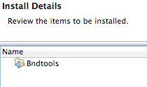

# 安装 Bndtools

Bndtools现在支持所有4.4 Luna以上版本的Eclipse，包括4.6 Neon。

1.通过Marketplace安装

2.通过Update Site安装
******

## 通过Eclipse Marketplace安装

||||
| :-------------: |:-------------|:------------|
|**1.**||从Help菜单选择Eclipse Marketplace菜单项。如果是你第一次使用Marketplace，可能会要求你选择一个解决方案类别（Solution catalog）。选择“Eclipse Marketplace”然后点击Next按钮。|
|**2.**||在搜素框中输入bnd，然后点击Go按钮。点击Bndtools选项旁的“Install”按钮。|
|**3.**||根据向导中的提示信息逐步完成向导步骤。|
******

## 通过Update Site安装

||||
| :-------------: |:-------------|:------------|
|**1.**||从Help菜单选择New Software...菜单项。在打开的对话框中点击右上角"Add..."按钮。|
|**2.**||在Name文本框中输入Bndtools，在Location文本框中选择如下URL之一进行输入。如果要选择最新的稳定版本，请使用如下链接：https://dl.bintray.com/bndtools/bndtools/latest/要选择其它版本，请参考如下表格。|
|**3.**||确保从“Work with”下拉选择列表中选额Bndtools。然后勾选软件列表中的Bndtools并点击Next按钮。|
|**4.**||再次点击Next按钮来确认安装操作。根据提示逐步完成向导。|

******

## 安装开发版或旧版产品

Eclipse Marketplace只能用于安装最新的稳定版Bndtools(目前为2.4.1）。如果你希望安装一个开发版或旧版的Bndtools，你必须使用上面提到的从Update Site安装的方法。下面的更新URL是可用的：

| **版本**        | **Update Site URL** |
| :-------------: |:-------------| 
| 开发版快照|注意:此版本源自最新版本的代码，所以可能不稳定或者包含一些探索性的功能。https://bndtools.ci.cloudbees.com/job/bndtools.master/lastSuccessfulBuild/artifact/build/generated/p2/ |
| Release 3.1.1 (2016.1.22)|https://dl.bintray.com/bndtools/bndtools/3.1.1/| 
|Release 3.1.0 (015.12.18)|https://dl.bintray.com/bndtools/bndtools/3.1.0/| 
|Release 3.0.0 (2015.9.10)|https://bndtools-updates.s3.amazonaws.com/3.0.0.REL/|
|Release 2.4.0 (2014.11.3)|https://bndtools-updates.s3.amazonaws.com/2.4.0.REL/|
|Release 2.3.0 (2014.5.10)|https://bndtools-updates.s3.amazonaws.com/2.3.0.REL/|
|Release 2.2.2 (2013.1.25)|https://bndtools-updates.s3.amazonaws.com/2.2.2.REL/|

******

注意：对于旧版本的Bug不一定会进行修复。

